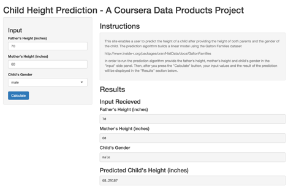
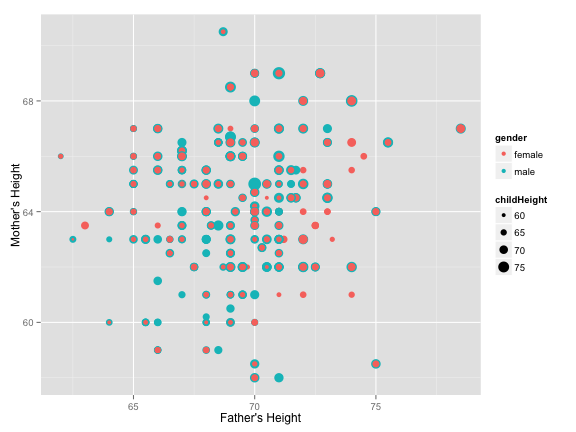

## Child Height Prediction Product

The Child Height Prediction Product (CHPP) is an interactive website that predicts a child's height based on the child's gender and the height of each of the child's parents. The website was developed as a course project for the Developing Data Products Coursera Course.

https://www.coursera.org/learn/data-products


---

## Benefits

Many excited couples are interested in knowing the potential physical characteristics of their unborn offspring such as gender and eye color. This website will be a useful tool in providing these couples with a statistically accurate prediction for the possible height of their children.

---

## Steps

To use the CHPP website you perform the following steps:

1. Input father's height
2. Input mother's height
3. Input the gender of the child
4. Click the "Calculate" button



---

## Data

The Galton Families dataset informs the prediction algorithm which powers the CHPP.
http://www.inside-r.org/packages/cran/HistData/docs/GaltonFamilies

 

---

## Algorithm

The CHPP prediction algorithm uses a linear model with explanatory variables father's height, mother's height and child's gender with dependent variable child height.

### Linear Model Prediction Example

```r
lm <- lm(childHeight ~ father + mother + gender, data = GaltonFamilies)
df_newdata <- data.frame(father = 80.5, mother = 59.0, gender = 'male')
predict(lm, newdata = df_newdata, interval = "prediction")
```

```
##        fit      lwr      upr
## 1 72.09911 67.78504 76.41318
```

---

## Conclusion

The Child Height Prediction Product will continue to become a more useful tool. Additional family data wil be gathered and added to the model. This additional data will make the model's prediction algorithm more accurate which will utimatly make the tool more desirable for curious couples.


